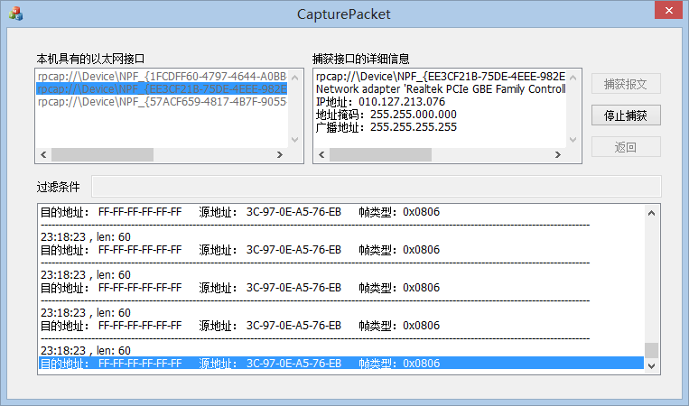

# IP 数据报捕获与分析

## 一、 实验要求介绍
本实验要求利用 WinPcap 提供的功能获取网络接口设备列表和各接口的详细信息，同时可以对任意一块网络接口卡进行 IP 数据报进行校验和验证。

- 实验环境：以太网环境
- 实验方法：利用 WinPcap 或 LibPcap 编写捕获与分析程序
- 实验目的:
	- 学习网络数据包捕获方法；
	- 初步掌握网络监听与分析技术的实现过程；
	-  利用 WinPcap 编写数据报捕获程序，要求能够解析以太网帧的源地址、目的地址和类型/长度域

本实验的目的是获取以太网中主机的 MAC 地址，因此以太网在该实验中是必不可少的。本实验使用的以太网既可以是共享式以太网，也可以是交换式以太网。

## 二、 实验编译运行环境 

本程序编译环境是：Visual Studio 2012；系统环境是：Windows 8（64位）；

## 三、 编写 IP 数据报捕获与分析软件运行效果
程序最终界面如下：

程序正常捕获数据报界面如下:

使用过滤条件时如下(这里以只筛选出 ARP 报文为例):

下面就程序各部分详细功能简单介绍:

- 接口区:

	此部分显示当前运行机器上具有的网卡接口列表,并且可以已通过单击选中接口,并且在右侧的“捕获接口的详细信息”区域显示当前选中的接口的详细信息。当点击“捕获报文”按钮进行捕获之后,此部分变成失效状
态,即不可更改。

- 接口信息区:

	此部分会显示在“本机具有的以太网接口”区域选中的接口的详细信息,会显示网卡接口的描述信息、IP 地址信息、地址掩码、广播地址。并且会随着接口区选定的接口的改变而改变。

- 按钮区:

	此部分具有“捕获报文”、“停止捕获”、“返回”三个按钮。负责捕获数据报和停止返回的功能。

	其中当点击“捕获报文”后就不可以更改网卡接口,并且会将经由该网卡接口的所有数据报逐条捕获显示特定信息在屏幕上。

	当点击“停止捕获”按钮后,会停止捕获选定网卡接口的数据报。

	当点击“返回”按钮后,会清空在“截获数据报”区域的数据报信息,并且此时可以更改接口列表。

- 过滤区:

	此部分可以输入一个大于等于 0 的整数,默认是 0 的话就会显示所有捕获选定网卡接口的数据报,如果是其他整数的话就会只显示该帧类型的数据报截获信息。
	
- 截获数据包区:

	此部分会逐条显示捕获数据报,会显示时间、帧长度、目的地址、源地址、帧类型。

## 四、其他

实验原理和程序实现步骤及代码见代码和文档

